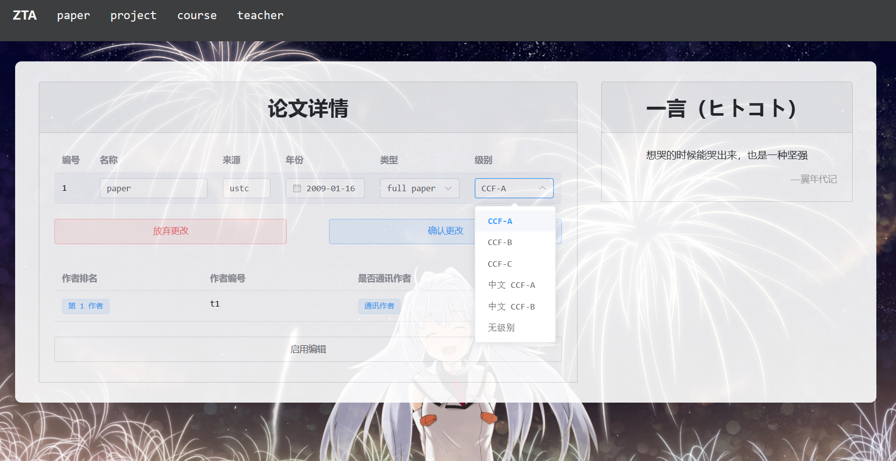
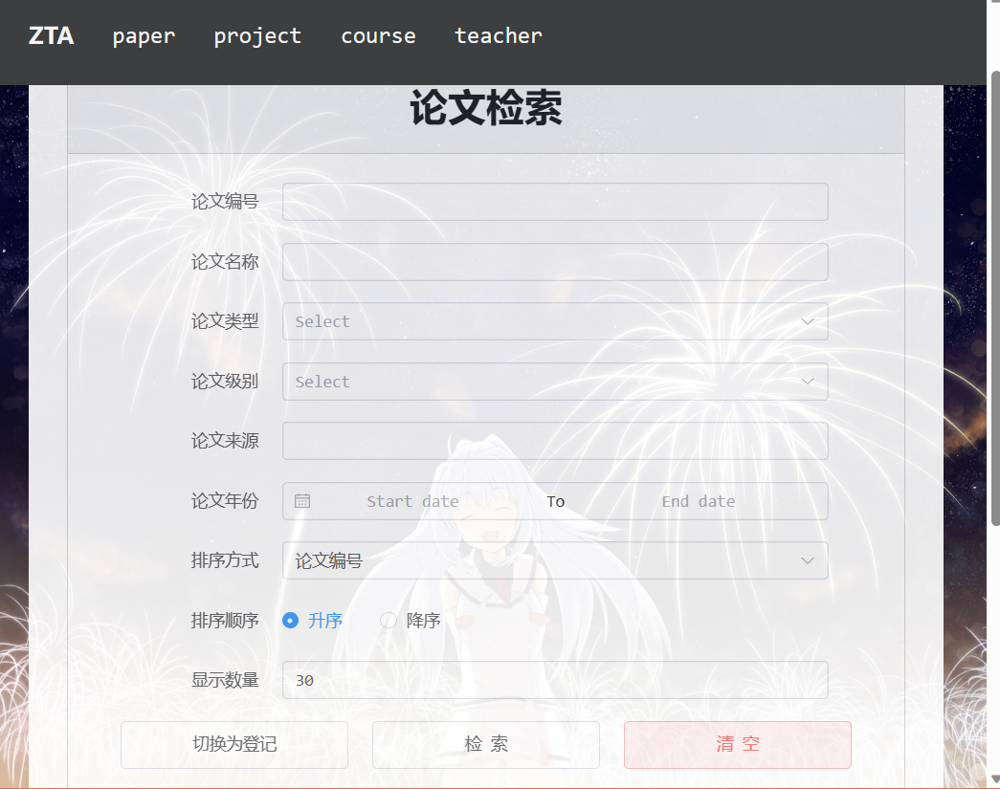

# vue3_element-plus_mysql_asp.net.demo

这是 zzyyyl 的数据库大作业。

前端使用 vue3 + element-plus, 后端使用 asp.net minimal api.

也可以作为 vue3 + element-plus + asp.net + mysql 的 demo 参考。

## 运行方法

首先运行后端 ZtaTeacherAssistant\ZtaServer\WebApi\bin\Debug\net6.0\WebApi.exe ,

然后在 ZtaTeacherAssistant\ZtaClient 中执行 `npm run dev`.

## 界面参考

